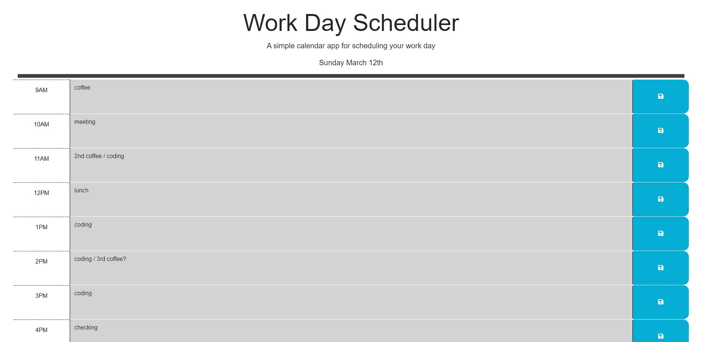

# workday-scheduler

A dynamic scheduling tool for the working hours of any given day.

Link to live application: https://misterbham.github.io/workday-scheduler/

This application assist with the planning and organization of a normal working business day, ranging from hours 9am-5pm.
The application utilizes the dayJS API to pull the current date and time, and uses the time value to color code the scheduler as the day progresses.

Grey color denotes previous, or past time frame.
Red color denotes the current hour.
Green color denotes upcoming, or future time frame.

The application user can freely type in their action items to be performed at various times during the day, and the values are stored into localStorage, meaning the webpage can be fully closed and reopened at a later time without losing any data.

With this application, I learned how to factor code through jQuery and having functions that run automatically on page load. And localStorage was used to record the text content of each hour and reinstate the text through page closure.
